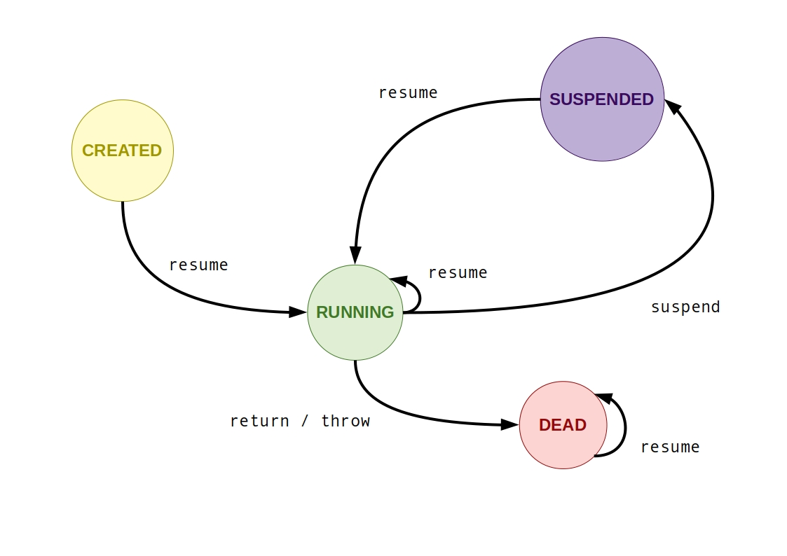

# sporadic.coroutines

Coroutines on top of Promises.

Coroutines are an old/classical abstraction in the same sense of Promises. Both
were introduced decades ago, the former is well-known by its native implementation
on the [Lua language][1] (which takes inspiration on both _CLU and Icon languages_),
while the latter, by the yet unknown history on the _E language_ (see the
[history of promises][2]) and the well-known support for JavaScript. The difference
between coroutines and promises is that coroutines are synchronous stateful
procedures and promises are asynchronous effectful computations, but we can
implement one on top of other and vice-versa (this is what we're doing here).

Coroutines are also different from Threads, the former enables _Cooperative
Multi-tasking_ while the latter implies in the _Preemptive_ one. Often said to
generalize subroutines by providing multiple entry-points, coroutines allow us
to express any sort of complex control flow easily, for example, exceptions,
infinite lazy lists, pipes, and so on. This [paper][3] explain 2 kinds of coroutines:
asymmetrical and symmetrical ones. This submodule in the case implements the first version.

## API Usage

Assuming that you've loaded the [UNPKG bundle][4] or installed from NPM and
required that library as `sporadic`, to create a coroutine we will just use
the following pattern:

```javascript
const coroutines = sporadic.coroutines;
const coroutine = await coroutines.create(async function (argument) {
  // ...

  // supply & demand are arbitrary values
  const demand = await this.suspend(supply);

  // ...
  return result;
});
```

Note here that coroutines only work with asynchronous functions but not asynchronous
arrow functions. It's 'cause arrow functions cannot bind `this`, instead, they
inherit that from lexical/parent scope. That is, this piece of code below would
not work well, and thus, generating buggy coroutines:

```javascript
const coroutine = await coroutines.create(async (argument) => {
  // ...
});
```

The `this.suspend(_)` operation is called as that to not collide with the keyword
`yield` of generators, but the idea/behavior resemble the same. By calling
`.suspend()`, you freeze the computation and gives back control for the coroutine's
caller (the passed value will be replied for this caller).
Said that, this `this` object will contain the following structure/typing:

```javascript
const state = this.status()
const demand = await this.suspend(supply)

const demandsStream = this.demands()
const suppliesStream = this.supplies()
```

Where `state` can be either `'CREATED', 'RUNNING', 'SUSPENDED', 'DEAD'` and
both `demandsStream` & `suppliesStream` are sporadic.streams (which subscribe
to the sent and replied values from and to coroutine's caller, respectively).
While `.status()`, `.demands()` and `.supplies()` can be called outside the coroutine
scope, calling `.suspend(_)` outside the associated coroutine scope, that is,
when it's not `'RUNNING'`, will throw an exception during that leaked operation.
This constraint is implemented due buggy issues to not violate our invariants.

---

To run a coroutine, we can use:

```javascript
const output = await sporadic.coroutines.resume(coroutine, input)
```

Where `input` and `output` can be arbitrary values. The `resume` operation
expects a valid coroutine object in either `CREATED` or `SUSPENDED` state, during
the execution it becomes `RUNNING`, and after the promise resolution, it can be
either `SUSPENDED` or `DEAD`. If the coroutine is `CREATED`, the `input` argument
will be passed to the coroutine async function as a parameter. Otherwise, it resolves
a pending `this.suspend(_)` call. After running, if the coroutine is `DEAD`, it's
due a `return` statement or a `throw` one occurring upon execution. In any case,
you can use:

```javascript
const result = await sporadic.coroutines.complete(coroutine)
```

To check the final coroutine result, but keep in mind this is the same promise
outcome of calling `.resume()` and the promise switching to `DEAD` state. In the
`DEAD` state, further calls to `.resume(coroutine, value)` fail, and the associated
supply and demand streams are finally closed. If the coroutine have still pending
computations, it will become `SUSPENDED`, meaning that you can resume that again
later.

To help you to grasp/grok the whole thing, the following state machine diagram
may be useful:



---

To check the status of any coroutine, we provide:

```javascript
const state = sporadic.coroutines.status(coroutine)
```

It's the same behavior of calling `this.status()` inside the coroutine execution,
the difference is the additional argument to look for some coroutine. The same holds
for `this.supplies()` and `this.demands()`, only if `coroutine` and `this` refer
to the same underlying computation:

```
sporadic.coroutines.demands(coroutine) = this.demands()
sporadic.coroutines.supplies(coroutine) = this.supplies()
```

They are the same stream if the underlying computations are the same, so using the
`sporadic.streams` API on any of them doesn't make any difference at all. Due such
equality, _this coroutine configuration may leak/hug memory_, 'cause in the sporadic's
streams model, it's needed to discard unused previous stream points references. This
whole stream points persistence is not a problem if your coroutines are short-lived
tasks, but if they're long-lived ones, such as database connection pools,
_it can really hurt the application's memory consumption_.
**To avoid that, you can configure the coroutine a priori**:

```javascript
const coroutine = await sporadic.coroutines.create(async function (argument) {
  // ...
  return result
}, { streamsMode: 'COLLECT' })
```

This `streamsMode` option will move the stream points forward whenever they're used.
To not lost any events (that is, _glitches_), in such case, you can call `.supplies()`
and `.demands()` _early_ (i.e, before the first `.resume()` call),
_but don't forget to move your unnecessary stream points forward as well_.
If you want to disable the `.supplies()` and `.demands()` streams entirely for the
coroutine, you can use `{ streamsMode: 'DISABLE' }`. With this `'DISABLE'` configuration,
no streams are ever created/allocated, and whenever `.supplies()` and `.demands()` are
called on this coroutine, an error is thrown describing that streams were not created
for such coroutine. The default value for `streamsMode` option is `'PERSIST'`, where
all streams points are persisted during coroutine's lifetime.

---

To import all public functions within this submodule, this pattern suffices:

```javascript
const {
  create, resume, status, demands, supplies
} = sporadic.coroutines;
```

  [1]: https://www.lua.org/pil/9.1.html
  [2]: https://en.wikipedia.org/wiki/Futures_and_promises#History
  [3]: http://www.inf.puc-rio.br/~roberto/docs/MCC15-04.pdf
  [4]: https://unpkg.com/sporadic/dist/index.js

<style>
  img[alt=coroutine-state-machine] {
    width: 100%;
  }
</style>
